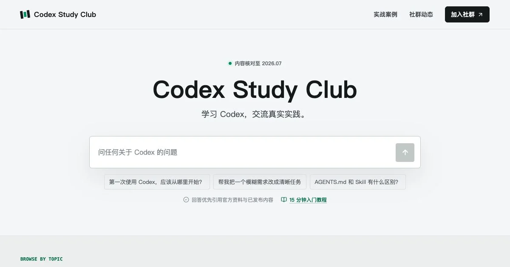

# Codex Study Club

> OpenAI Codex 中文学习、教程与实战社区 | A Chinese learning and practice hub for OpenAI Codex

[中文说明](#中文说明) · [English](#english) · [在线访问](https://codex.modelsp.com) · [开源赞助计划](https://codex.modelsp.com/agent-awards)



Codex Study Club 面向正在学习和使用 OpenAI Codex 的开发者，持续整理 **Codex App、Codex CLI、Codex Cloud、AGENTS.md、Skills、MCP、自动化、代码审查与问题排查** 等中文教程和可复现实战案例。项目还提供一个基于本地 Markdown 知识库的问答助手，帮助读者更快找到相关内容。

## 最新活动（2026 年 7 月） / Current Campaign (July 2026)

### Modelsell 开源项目赞助计划：每个通过审核的项目可获 $500+ 算力额度

计划长期开放，不限项目领域、编程语言和技术栈。优质开源项目在 README、官网或产品 About 页面展示 [Modelsell](https://modelsell.com/) 并通过质量与合规审核后，即可获得价值 **500 美元以上**的平台算力额度。

- 适用项目：AI 与 Agent、开发者工具、CLI、IDE 工具、自动化、DevOps、框架、SDK、基础设施、桌面/Web/移动应用等。
- 基础要求：公开核心代码、提供清晰的开源协议、展示 Modelsell 链接，并提供可核验的产品演示。
- 赞助形式：Modelsell 平台算力额度，不可提现或转让；更高额度根据项目影响力、成熟度和复用价值确定。
- 审核方式：材料齐全后滚动审核，结果在原申请中同步。

**[查看活动详情](https://codex.modelsp.com/agent-awards) · [提交赞助申请](https://github.com/modelsell/codex-study-club/issues/new?template=open-source-sponsor.yml)**

---

## 中文说明

### 项目内容

- **Codex 新手教程**：从安装、账号与套餐，到第一个可验证任务、CLI、IDE、Cloud 和移动端协作。
- **真实实战案例**：覆盖开发自动化、CI 修复、代码审查、内容设计、知识协作、工具设备与常见问题排查。
- **Codex Skills 与 MCP**：整理可复用 Skill、MCP 工具、浏览器自动化和团队工作流。
- **中文问答助手**：检索仓库内的 Markdown 内容；配置 API Key 后可通过 OpenAI Responses API 生成带上下文的回答。
- **主题与视觉定制**：收录 Codex Desktop 主题、安装方法和展示图库。
- **行业解读与社区动态**：发布经过来源核对的 AI 行业专题、Codex 产品动态和社区实践。
- **搜索与分享支持**：提供静态页面、Canonical URL、Sitemap、robots、Open Graph 和结构化数据。

### 快速访问

| 内容 | 地址 |
| --- | --- |
| 在线站点 | [codex.modelsp.com](https://codex.modelsp.com) |
| 完整新手入门 | [新手教程](https://codex.modelsp.com/start/01-what-is-codex) |
| Codex 实战案例 | [案例库](https://codex.modelsp.com/cases) |
| 问题排查 | [Troubleshooting](https://codex.modelsp.com/cases#troubleshooting) |
| Codex 主题 | [主题与视觉](https://codex.modelsp.com/themes) |
| 行业解读 | [Industry Insights](https://codex.modelsp.com/industry-insights) |
| Modelsell 开源赞助 | [$500+ 算力赞助](https://codex.modelsp.com/agent-awards) |

### 技术架构

```text
content/**/*.md / content/*.html
              |
              v
lib/content.ts --------------------> Next.js 内容页面
              |
              v
lib/knowledge-base.ts ------------> /api/chat
                                      |
                                      +-- 未配置 API Key：返回本地答案与内容链接
                                      +-- 已配置 API Key：检索上下文并调用 Responses API
```

站点使用 Next.js App Router、React 和 TypeScript 构建，通过 OpenNext 部署到 Cloudflare Workers。教程、案例、主题和社区动态以 Markdown 维护，行业解读支持独立 HTML 文档。

```text
content/
├── assistant/             # 问答助手的定向知识
├── cases/
│   ├── getting-started/   # 入门工作流
│   ├── troubleshooting/   # 问题排查
│   ├── development/       # 开发与自动化
│   ├── content-design/    # 内容与设计
│   ├── knowledge/         # 知识与协作
│   └── tools-devices/     # 工具与设备
├── community-updates/     # 社区动态
├── start/                 # 系统化新手教程
├── themes/                # Codex Desktop 主题
├── tutorials/             # 专题教程
└── *.html                 # 行业解读文档
```

详细的 Frontmatter 格式和写作规则请查看 [content/README.md](content/README.md)。

### 本地开发

环境要求：Node.js 20.9 或更高版本、npm。

```bash
git clone https://github.com/modelsell/codex-study-club.git
cd codex-study-club
npm install
cp .env.example .env.local
npm run dev
```

打开 [http://localhost:3000](http://localhost:3000)。不配置 `OPENAI_API_KEY` 也可以运行，问答助手会返回本地知识库中的答案和相关链接。

### 环境变量

| 变量 | 是否必需 | 说明 |
| --- | --- | --- |
| `OPENAI_API_KEY` | 否 | 启用 OpenAI Responses API 生成式回答；请仅在服务端配置。 |
| `OPENAI_BASE_URL` | 否 | Responses API 地址，默认 `https://api.openai.com/v1`。 |
| `OPENAI_MODEL` | 否 | 问答助手使用的模型，默认值见 `.env.example`。 |
| `NEXT_PUBLIC_SITE_URL` | 生产环境 | 用于 Canonical URL、Sitemap 和社交分享元数据的公开域名。 |
| `NEXT_PUBLIC_COMMUNITY_JOIN_URL` | 否 | 社区加入按钮所使用的支付或引导地址。 |

不要提交 `.env.local`、API Key、用户数据或其他敏感信息。

### 常用命令

```bash
npm run dev                 # 启动本地开发服务器
npm run lint                # 运行 ESLint
npm run build               # 生成内容并构建生产版本
npm run cf-build            # 构建 Cloudflare Workers 版本
npm run preview             # 本地预览 OpenNext 构建
npm run import:codexguide   # 刷新分类导入的案例内容
```

### 贡献内容

1. 在 `content/` 对应目录新增或修改 Markdown/HTML 文档。
2. 按 [内容写作规范](content/README.md) 填写 Frontmatter、来源、核对日期和图片说明。
3. 图片放在 `public/` 下，并使用以 `/` 开头的站内路径引用。
4. 运行 `npm run lint` 和 `npm run build`。
5. 提交 Pull Request，并说明内容来源、适用版本和验证方式。

新增案例、教程或社区动态通常不需要修改 TypeScript 内容数组，构建时会自动进入页面索引和本地知识库。

### 相关主题与搜索关键词

OpenAI Codex、Codex 中文教程、Codex App、Codex CLI、Codex Cloud、Codex IDE、Codex Skills、Codex MCP、AGENTS.md、AI Agent、代码审查、GitHub Actions、CI 修复、浏览器自动化、开发者工作流、Modelsell 开源赞助。

---

## English

### About

Codex Study Club is a Chinese-first, open knowledge hub for learning and using OpenAI Codex. It publishes searchable tutorials, reproducible case studies, troubleshooting guides, Codex Skills, MCP workflows, theme resources, community updates, and AI industry insights.

The homepage assistant retrieves answers from the same local Markdown repository. It works without an API key by returning matching local content, and can use the OpenAI Responses API for contextual generated answers when a server-side key is configured.

### Current Campaign: $500+ Compute Sponsorship for Open-Source Projects

The Modelsell Open-Source Sponsorship Program is open on a rolling basis to quality projects in any field or technology stack. An eligible project must publish its core source code under a clear open-source license, display and link to [Modelsell](https://modelsell.com/) in its README, website, or About page, and provide a verifiable demo.

Approved projects receive at least **$500 in Modelsell compute credits**. Credits are non-cash and non-transferable; larger grants depend on project impact, maturity, reuse potential, and available budget.

**[Read the campaign details](https://codex.modelsp.com/agent-awards) · [Apply on GitHub](https://github.com/modelsell/codex-study-club/issues/new?template=open-source-sponsor.yml)**

### Highlights

- Step-by-step guides for Codex App, CLI, IDE, Cloud, and task design.
- Reproducible cases for development, automation, CI debugging, review, content creation, and knowledge work.
- Practical Codex Skills, MCP integrations, AGENTS.md guidance, and troubleshooting.
- Markdown-driven content with local retrieval and optional Responses API answers.
- SEO-ready static pages with canonical URLs, sitemap, robots metadata, Open Graph, and structured data.
- Next.js, React, TypeScript, OpenNext, and Cloudflare Workers deployment support.

### Run Locally

Requirements: Node.js 20.9 or newer and npm.

```bash
git clone https://github.com/modelsell/codex-study-club.git
cd codex-study-club
npm install
cp .env.example .env.local
npm run dev
```

Open [http://localhost:3000](http://localhost:3000). See the [Chinese development guide](#本地开发) for environment variables, commands, architecture, and contribution details.

### Contributing

Add content to the matching directory under `content/`, follow the schemas in [content/README.md](content/README.md), and verify changes with:

```bash
npm run lint
npm run build
```

Please include sources, applicable product versions or verification dates, and reproducible validation steps in content pull requests.

## Disclaimer

Codex Study Club is an independent community project and is not an official OpenAI website. Product behavior, availability, pricing, and documentation may change; verify current facts against the [official OpenAI Codex documentation](https://developers.openai.com/codex/).

Third-party content notices are documented in [THIRD_PARTY_NOTICES.md](THIRD_PARTY_NOTICES.md).
